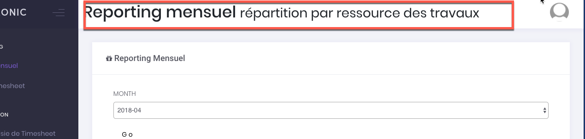

# Creating a page

## YAML Definition

```yaml
tellaw_sunshine_admin:
  pages:
    dashboardArticle :
      title: visualisation d'un article
      description:
      jsIncludes:
        - bundles/app/js/planning.js
        - bundles/app/js/message.js
      cssIncludes:
        - bundles/app/css/override.css
      rows:
        -
          viewWidget:
            title: viewArticle
            columns: 12
            service: sunshine.widgets.view
            template: widgets/view

          articleWorkflow:
            title: Workflow
            columns: 12
            service: AppBundle\Service\Widgets\ArticleWorkflow

          attachments:
            title: Fichier(s) joint(s)
            columns: 12
            service: AppBundle\Service\Widgets\Attachments

          listComments:
            title: Commentaires
            columns: 12
            service: AppBundle\Service\Widgets\Comment

          listMessages:
            title: Messages
            columns: 12
            service: AppBundle\Service\Widgets\Message

          planningWorkflow:
            title: Planning
            columns: 12
            service: AppBundle\Service\Widgets\Planning

```

## Conventions


* Identifiers and property keys always start with a lower case 
* Widgets should be locate in a separated namespace 'AppBundle\Service\Widgets\...'


## Title & Description

```yaml
tellaw_sunshine_admin:
  pages:
    dashboardArticle :
      title: visualisation d'un article
      description: description de la page
```

The description and title of pages are used in the header of the admin page rendering \(just before any widget\).




## jsIncludes

This section can contain a list of links to your aditionals JS files. the path must be related to your public \(SF4 and+\) or web \(SF2&3\) directory.

## cssIncludes

This section can contain a list of links to your aditionals CSS files. the path must be related to your public \(SF4 and+\) or web \(SF2&3\) directory.

## rows

Admin pages are based on a 12 columns grid. Each line is called a 'row'. You can define as many rows as you want.

You also can build a fluid page, using a single row, and making the widgets going to a new line by themselves.

## Using Widgets

A widget is following the MVC pattern.   
- The Model is yours.  
- The 'Controller' is replaced by a Symfony service.  
- The 'View' is a fragment of twig template.

It is also possible to use some 're-usable' widgets available in the bundle. 


Read documentation pages for :

* Creating a widget \(service\).
* Using a re-usable widget.


```yaml
  viewWidget:  --> ID or Name of the widget
    title: viewArticle
    columns: 12
    service: sunshine.widgets.view
    template: widgets/view

  articleWorkflow:
    title: Workflow
    columns: 12
    service: AppBundle\Service\Widgets\ArticleWorkflow

```

A widget definition must contains the informations :

| Item | Descriptions | Required |
| --- | --- | --- | --- | --- | --- | --- |
| Name or ID | This is a uniq identifier of the widget on a page. | Yes |
| title | Title of the widget | No |
| description | Description of the widget | No |
| columns | Number of columns the widget should take \(max 12\) | Yes |
| service | Path or alias of the service. | Yes |
| template |  |  |

## Adding the page to the menu

Please read menu configuration to understand how to add your [new page to the menu](menu-configuration.md).

The current page can be linked using the following syntax:

```yaml
tellaw_sunshine_admin:
  menu:
    -
      label: Dashboard
      type: section
      children:
        -
          label: Articles
          type: page
          parameters:
            id: dashboardArticle
```


