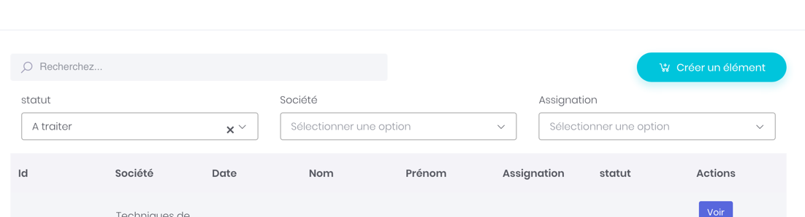

# Filtering : Custom values in Select2 lists



Sometimes, it'll be very usefull to filter datas in lists, for the current user, or simply set a custom list of values in a list.

You can configure a custom list of datas in each filters using a method in the repository avec YAML configuration.

Imagine the following model. We have a user, linked to a department \(service\) and to a company. We would like the filter to limit its values to the companies linked to the user.

The dropdown list we want to filter target the company \(societe\). It is in its repository that we'll add the custom method.

## 1/ Add method to the 'company' repository.

```text
/** * Return all companies related to a user. * * @param User $user * @return QueryBuilder */public function getUserAvailableSocietes( $identifier, $toString, $query ){    $qb = $this->createQueryBuilder('s');    $qb->select(array('s.' . $identifier[0], 's.' . $toString . " AS text"));    if (!$this->user->hasRole('ROLE_ADMIN')) {        $qb ->innerJoin( 's.departments', 'se'  )            ->innerJoin( 'se.users', 'us' )            ->where( 'us.id = :userId' )            ->setParameter( 'userId', $this->user->getId() );    }    return $qb;}
```

Note the signature of the method, you must respect it.

```php
public function getUserAvailableSocietes( $identifier, $toString, $query )
```

* $**identifier** : Is an array, where first index is the indentifier of the class. It should be used as 'value'.
* $**toString** : Is the attribute you want to display as texte.
* $**query** : Could be a prepared querybuilder, given to the method.


Be carrefull to select only 2 fields in your query :

* The ID as first item.
* The Text value as second.

If you do not respect that, you may have slow performances, and maybe errors returned from Symfony Serializer of circular references.


2/ Configure this custom data set in YAML

In the Entity YAML, configure your custom data set.tellaw\_sunshine\_admin:

```yaml
  entities:    InfoRequest:      configuration:         id: id         class: App\Entity\InfoRequest      attributes:        id:          label: Id        question:          label: Question          filterAttribute: label          relatedClass: App:Question        societe:          label: Société          filterAttribute: label          relatedClass: App:Societe          callbackFunction: getUserAvailableSocietes                    ...
```

Note the usage of **getUserAvailableSociete** in the configuration. This will be used by the framework to be used as the callback when loading list datas.

This is it :-\)

