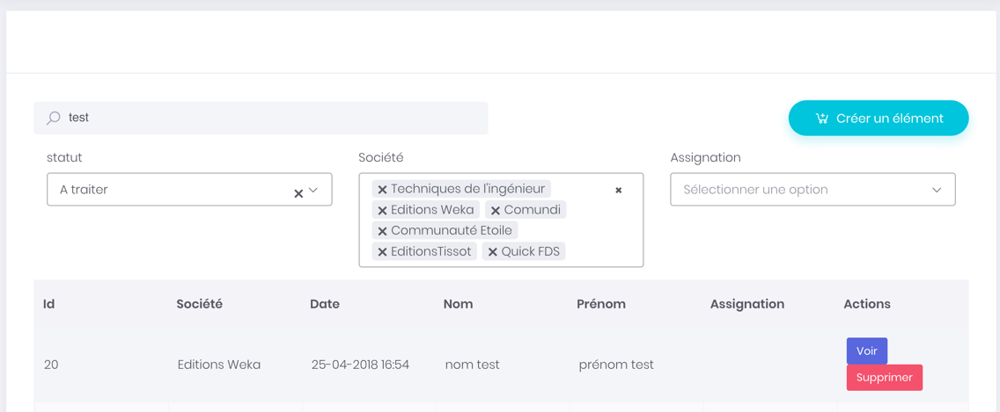
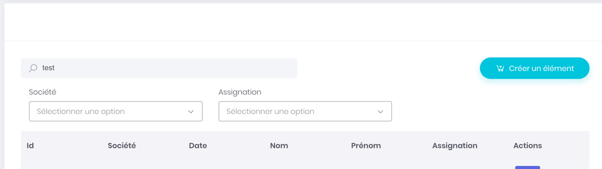
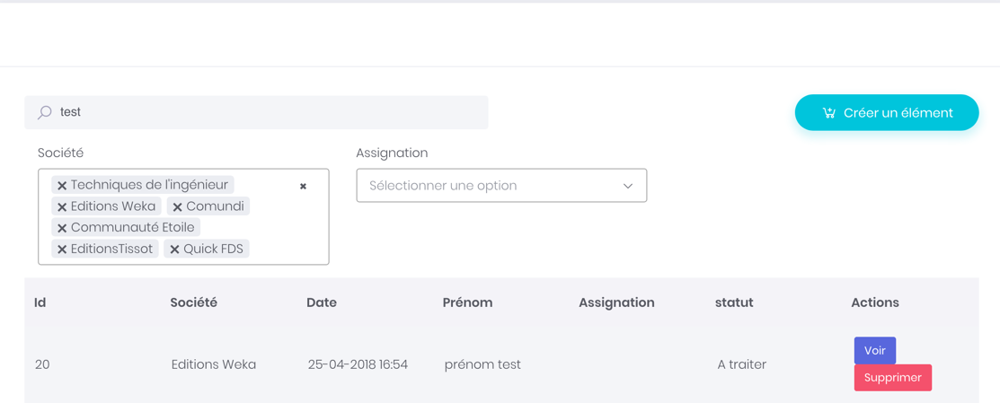

# Generic Widgets : LIST

## YAML Configuration

If you want to use a list widget inside a page, please use the following code :

```yaml
tellaw_sunshine_admin:
  pages:
    pendingInfoRequestGrid:  #Id of the custom page
      title: The title of my page 
      rows:
        -
          pendingInfoRequestGrid:  # Id of the widget
            title: My widget title
            description: My Widget description
            columns: 12   # Number of columns used by the widget
            service: sunshine.widgets.list # Id of the generic list widget
            parameters:
              entityName: InfoRequest
              filters:
                status:
                  field: code
                  value: pending
                societe:
                  method: getUserSocietes
              searchKey: test
              override:
                list:
                  include:
                    - societe
                  exclude:
                    - status
                filters:
                  include:
                    - societe
                  exclude:
                    - status

```


the service alias for the widget is : **sunshine.widgets.list**

The class used is : **Tellaw\SunshineAdminBundle\Service\Widgets\ListWidget**


## Configuration Inheritance

The entity configuration handle all the details for list, filters and every configuration elements. But you can also customize its configuration in any page to customize :

* Which fields should be rendered.
* Which filters should be rendered.
* What datasources, filters may use.

### Section Filters

This section make possible for you to set the default values of the filters. Two options to do it :

* Using a property of the entity.
* Writing a method returning a set of datas.



#### Method 1 : Using an attribute of the entity

```yaml
filters:
	status:
		field: code
		value: pending
	
```

Using this configuration, the filter '**status**' will load by default the data '**pending**' of its property '**code**'.

This is like writing :

```php
$this->em->getRepository(StatusRepository::class)->findOneBy(array("code" => "pending"))
```

The data used by the framework to render the value in the list, will be the field 'filterAttribute' defined in the entity.


Note, that the **Status** entity has to define a getId\(\) method, returning a uniq ID.


#### Method 2 : Writing a custom method.

This method make it possible for you to write a method used by the framework to load default values.

Imagine that your users are linked to companies and departments. You may want to preset in the filter every company of the user.

In the configuration specify the method to use :

```yaml
filters:    
	societe:
		method: getUserSocietes
```

And the implement the function in the repository of the entity used by the list :

```php
public function getUserSocietes ( $filterKey, $filtersConfiguration ) {    $qb = $this->createQueryBuilder('s');    $qb->select(array('s.id', 's.label'));        if (!$this->user->hasRole('ROLE_ADMIN')) {        $qb ->innerJoin( 's.services', 'se'  )            ->innerJoin( 'se.users', 'us' )            ->where( 'us.id = :userId' )            ->setParameter( 'userId', $this->user->getId() );    }    $query = $qb->getQuery();    $results = $query->getResult();    $output = array();    foreach ($results as $result) {        $output[$result["label"]] = $result["id"];    }    return $output;}
```

Note the interface of the function :

```php
public function myCustomFunction ( $filterKey, $filtersConfiguration );
```

* **$filterKey** is the id of the filter requiring datas. In this case : 'societe'
* **$filtersConfiguration** is an array with the configuration of the filters of the page.

Note also that the method has to return an array with the format :

```php
Array myArray["label of the data"] = "value of the data";
```

### SearchKey

The search key attribute makes possible to preset the search field.

```yaml
searchKey: test
```



### Override \(List & Filters\)

With overrides, you can add or remove element on :

* Columns of the list.
* Filters.

The override section must be located in parameter's section of the page :

```yaml
parameters:
	override:
		list:
			include:
				- societe
			exclude:
				- lastname
		filters:
			include:
				- societe
			exclude:
				- status

```

This configuration will :

* Add the **societe** column in the list.
* Remove the **lastname** column from the list
* Add the **societe** filter to the filters tab.
* Remove the **status** filter from the filter tab.



### include

This directive will try to add the filter or the column in the widget. The column must be configured correctly in the entity.

### exclude

This directive will remove a filter or column from the widget.


## Configure the data source of the list

You need also to be able to configure your datasource for the list. The configuration described previously makes possible to set defaults values, but it doesn't filter the resultset.

This can be done in the entity configuration. At the relation, define a 'callback' method.

```yaml
tellaw_sunshine_admin:
  entities:
    InfoRequest:
      configuration:
         id: id
         class: App\Entity\InfoRequest

      attributes:
        id:
          label: Id
        question:
          label: Question
          filterAttribute: label
          relatedClass: App:Question
        societe:
          label: Société
          filterAttribute: label
          relatedClass: App:Societe
          callbackFunction: getUserAvailableSocietes
        lastname:
          label: Nom
```

In the configuration, the list 'societe' will load its data from the callbackFunction : 'getAvailableSocietes'

Implement this method in the repository of the parent entity.

```php
    /**
     * Return companies for a user.
     *
     * @param User $user
     * @return QueryBuilder
     */
    public function getUserAvailableSocietes( $identifier, $toString, $query )
    {

        $qb = $this->createQueryBuilder('s');
        $qb->select(array('s.' . $identifier[0], 's.' . $toString . " AS text"));

        if (!$this->user->hasRole('ROLE_ADMIN')) {

            $qb ->innerJoin( 's.services', 'se'  )
                ->innerJoin( 'se.users', 'us' )
                ->where( 'us.id = :userId' )
                ->setParameter( 'userId', $this->user->getId() );

        }

        return $qb;
    }
```

Please read the documentation : [Filtering : Custom values in Select2 lists](filtering-custom-values-in-select2-lists.md)


